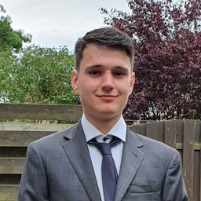
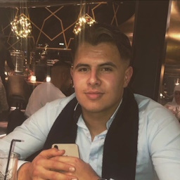
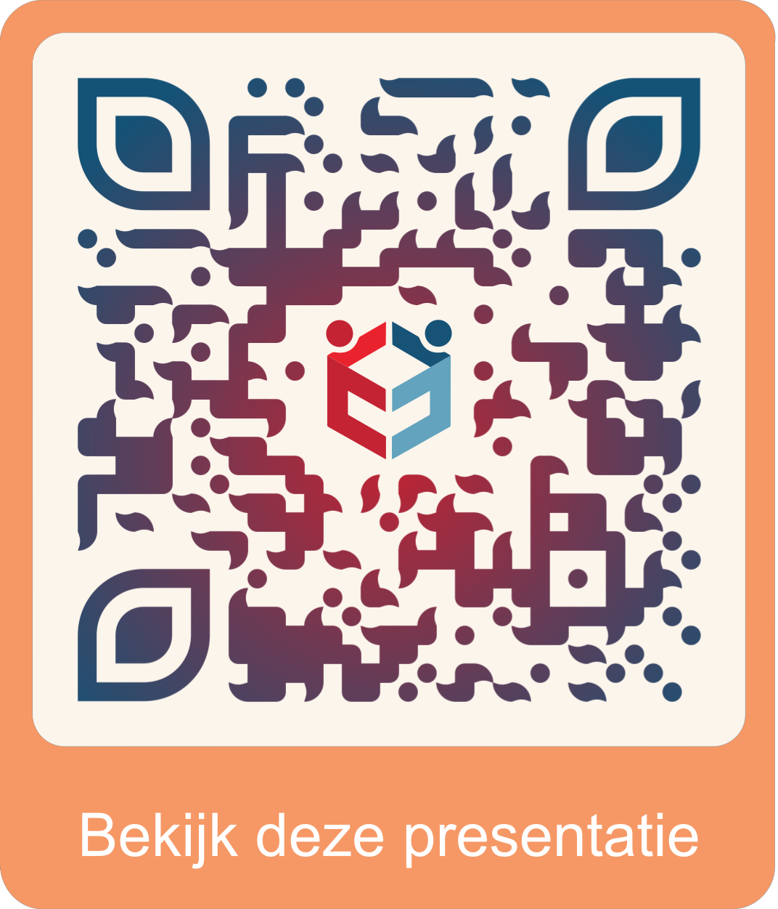

<!--
_class: lead gaia
_footer: " 2023-09-05"
_paginate: skip
-->

# <!--fit--> Jongerenraad Zutphen

Voor commissie Communicatie & Bestuurlijke vernieuwing

<!--
Gisteren had ik twee afspraken in de stad. Een was wat eerder klaar en de ander was verlaat, dus ik had opeens 40 minuten vrije tijd.

Normaal gesproken ben ik heel slecht met vrije tijd, ik plan mijn dagen helemaal vol. Maar nu dacht ik, ik verdien even een momentje. Dus ik ben langs de bakker gegaan, heb een belegd broodje gekocht, en ben aan de IJsselkade gaan zitten.

En toen ik aan de IJsselkade zat, dacht ik opeens bij mezelf: "Wat is onze stad toch mooi." Het zonnetje straalde fel, kinderen speelden met hun grootouders op de vernieuwde waterspeelplaats, schepen kabbelde over de IJssel, om 12 uur liepen mensen uit de Hoven over de Oude IJsselbrug om lunch te eten en om half 1 liepen ze weer terug. Ik denk niet dat we er genoeg bij stilstaan hoe mooi Zutphen is.

Dat is waarom ik het zo pijnlijk vind dat sommige jongeren niet in staat zijn om dat te kunnen denken. Omdat bepaalde steegjes, straten, wijken nog onveilig zijn. Omdat er geen woningen voor ze zijn en dus ergens anders heen moeten. Omdat ze gaan studeren en noodgedwongen weg moeten. Omdat er geen rekening met hun gehouden wordt bij de belangrijke politieke keuzes die over hun toekomst gemaakt worden. Wij bestaan voor die jongeren, om onze stad ook voor hun zo mooi te maken als die kan zijn.
-->

---

# **Hallo!**

|        Luka         |        Milan         |        Mathijs         |        Mehmet         |
|:-------------------:|:--------------------:|:----------------------:|:---------------------:|
|  |  |  |  |

Sinds 12 september 2020

<!--
Over een week zijn we 3 jaar oud
-->

---

# Waar gaan we het over hebben?
<!--
(Ik)
-->

1. Wat doen wij?
2. Wat willen wij doen?
3. Waarom lukt dat niet?
4. Hoe kunnen we dat oplossen?

---

<!--
_class: lead
_paginate: false
-->

# Wat **doen** wij?

Assisteren, organiseren, adviseren, en meer

---

# **Assisteren**

- Onderzoek LHBTI+ jongeren
- Omgevingsvisie 2040
- Gemeenteraadsverkiezingen 2022
- Ouder- en jeugdsteunpunt

---

# **Organiseren**

- Your Pride
- Anoroc
  <!--
  Helaas door nieuwe maatregelen op het laatste moment afgelast
  -->
- Cruyff Court
- Jong op de lijst
- Inputsessie omgevingsvisie
- Programmacommissie Hanzejaar
- Banden leggen en samenwerken

---

# **Adviseren**

- Jongerenbeleid
- Preventieakkoord
- Overgang minderjarig naar meerderjarig
- LHBTI+ jongeren
- Omgevingsvisie 2040
- Verschillende externe partijen (Villa Pinedo)
  <!--
  Wij ondersteunen Villa Pinedo om een campagne te starten voor meer bekendheid in Zutphen. Villa Pinedo helpt jongeren met gescheiden ouders.
  -->

---

# En **meer**

- Vertegenwoordiging bij NJR
- Burgemeestertrainingen jongerenparticipatie VNG
- Congres Lokale Preventieakkoorden

<!--
Samen met prinses Laurentien, als je goed kijkt kan je op de foto zelfs prins Constantijn zien
-->

---

<!--
_paginate: hold
-->

- Sarcastische grappen maken op onze socials

---

<!--
_class: lead
_paginate: false
-->

# Wat **willen** wij doen?

---

# Meer, beter, **persoonlijker**

* Studieplekkenproject
* Beter onderzoek
* Een grotere achterban
* Persoonlijker en toegankelijker
* Meer, betere, uitgebreide adviezen
* Meer activiteiten

---

<!--
_class: lead
_paginate: false
-->

# We kunnen niet de **impact** maken die we **willen** maken

---

<!--
_class: lead
_paginate: false
-->

# Waarom lukt dat **niet**?

---

# We staan er **alleen** voor

* 16 maanden alleen
  <!--
  Alle mails, alle projecten, alle congressen en ontmoetingen, wekelijkse posts op socials
  -->
* Scholen langsgegaan: 62 geïnteresseerd
  <!--
  Allemaal afgehaakt. Waarom? Veel werk, weinig resultaat & geen geld.
  -->
* Ondanks resultaat is het einde in zicht
  <!--
  2 evenementen, burgemeestertraining, rapport, krantenartikelen, Hanzejaar
  -->

---

# We hebben geen **middelen**

* Geen budget
* Geen leden
* Geen contactpersoon
* Geen informatie
  <!--
  We hebben ooit aan de griffie gevraagd of die ons op de hoogte kon houden van wat er huidig speelt. Het antwoord was: nee.
  -->
* Geen plek
  <!--
  Wij kunnen lastig plekken vinden om te vergaderen. Ontmoetingen met externen en leden gaan lastig. We hebben geen plek om onze spullen op te slaan, of post te ontvangen.
  -->

---

# We hebben geen **tijd**

* Er wordt veel gevraagd
* Geen tijd voor wat **wij** belangrijk vinden
* We lopen achter de feiten aan
  <!--
  Zoals de omgevingsvisie, we hebben een inputsessie georganiseerd, maar de omgevingsvisie was al bijna af.
  -->

---

<!--
_class: lead
_paginate: false
-->

# Op deze manier heeft de jongerenraad **geen toekomst**

---

<!--
_class: lead
_paginate: false
-->

# Hoe kunnen we dat **oplossen**?

---

<!--
_footer: Afbeelding © NJR
-->

# **Participatie**

- NJR en NJi
  <!--
  Nationale Jeugdraad & Nederlands Jeugdinstituut
  -->
- _Children's Participation: From Tokenism to Citizenship_, Roger A. Hart, 1992, UNICEF
- Schijnparticipatie
  <!--
  Afkopen
  Alleen in laten spreken op niet belangrijke onderwerpen, en de lastige beslissingen zelf maken
  -->

  <!--
  Decoratie
  Een blik jongeren opentrekken; jongeren ter decoratie ergens bij zetten
  -->

  <!--
  Manipulatie
  Jongeren minimaal betrekken bij een klein deel van het plan, zonder terugkoppeling
  -->

---

<!--
_footer: Afbeelding © CHOICE
-->

# Flower of **Participation**

---

<!--
_paginate: skip
-->

---

<!--
_paginate: skip
-->

<!--
Onze grond is rijk, onze beding is stevig. Maar zonder zon en water sterft onze bloem alsnog.
-->

---

<!--
_class: lead
_paginate: false
-->

# Dus wat vragen we **daadwerkelijk**?

Bronnen: [NJR](https://njr.nl/nl/verhalen/erkenning-verwachten), [nationale ombudsman](https://nationaleombudsman.nl/nieuws/artikel/2021/burgerinitiatief-wat-is-dat-nou-eigenlijk), [Movisie](https://movisie.nl/artikel/tijd-om-te-gaan-doen-wat-werkt-jongerenparticipatie), [NJi](https://nji.nl/system/files/2021-04/NJi-Handreiking-duurzame-jongerenparticipatie.pdf)

---

# **Immaterieel**

* Een open houding gericht op samenwerking
  <!--
  Jongeren worden serieus genomen, en de gemeente neemt verantwoordelijkheid in het proces en zorgt voor een duidelijke taakverdeling.
  -->
* Een vast contactpersoon
  <!--
  Niets zo frustrerend als loze beloften en van het kastje naar de muur gestuurd worden.
  -->
* Duidelijkheid over de mogelijkheden om mee te kunnen praten
  <!--
  Op welke thema's kunnen we input leveren (en welke juist niet), wat zijn de mogelijkheden binnen de gemeente, en op welke voorwaarden kunnen we meedenken?
  -->
* Geef jongerenparticipatie een duidelijke plek en borging
  <!--
  Bestuurlijk commitment is geen garantie voor succes. Voor gemeentemedewerkers die aan ons verbonden zijn moet het niet iets zijn "wat je erbij doet". Alkmaar identificeerde ambtenaren die er echt gemotiveerd voor waren, en zij plukken daar nu de vruchten van.
  -->
* Ondersteuning wanneer wij het niet weten
  <!--
  De nauwere gemeentelijke processen zijn voor ons vaak onduidelijk. Ons vaste contactpersoon kan ons helpen de goede wegen te nemen voor vergunningen en subsidies. Daarnaast willen wij een garantie hulp te krijgen als we ergens tegenaan lopen (bijvoorbeeld een externe kascontrole, of een accountant voor zaken als belastingaangifte en ANBI-documenten)
  -->

  <!--
  Als 20-jarige—naast een fulltime universitaire studie en baan—een vrijwilligersorganisatie uit de grond stampen, deze ANBI certificeren, en zorgen dat je alle relevante belastinginformatie opneemt, is soms lastig.
  -->

---

# **Materieel**

* Geld
  * Vacatiegelden
    <!--
    €100 / bestuurder / maand
    Iets minder dan de BASD 
    -->
  * Operationele kosten
    - Website
    - Cloud werkomgeving
    - Telefoon
    * Bankrekening
    * Boekhoudsysteem
    * Verzekeringen

---

# **Kantoor**

* Fysiek adres
  <!--
  Anders staan we in Enschede ingeschreven.
  -->
* Ontmoeting- en werkplek
  <!--
  Wij kunnen gasten en jongeren nu niet zelf ontvangen. Hiervoor moeten we op externe partijen terugvallen. Ook samenwerking gaat nu lastig, omdat we geen locatie hebben.
  -->
* Vergaderruimte
  <!--
  Elke maand verschillende externe organisaties moeten benaderen, hopend dat een plek heeft voor ons op een tijd die al onze leden schikt, kost ons veel tijd en energie, en is ronduit onhandig.
  -->
* Postadres en opslag
  <!--
  We hebben geen ruimte waar wij ons materiaal voor alle leden toegankelijk kunnen opslaan. Daarom vallen we terug op de huizen van onze ouders. Het komt vaker voor dat onze leden contactgegevens van ouders moeten delen, zodat een wat flyers kan oppikken bij de ouders van de anderen als diegene niet thuis is. Zo zijn we lastig serieus te nemen.
  -->
* Kan dit allemaal intern in de gemeente? Top!
  <!--
  Mocht er een ruimte qua formaat Satu Mare kamer beschikbaar zijn, dan heeft dit natuurlijk de voorkeur.
  -->
* Zo niet, IJsselkade 8

---

<!--
_paginate: skip
-->

---

<!--
_paginate: skip
-->

<!--
€174 / maand
-->

---

<!--
_class: lead
_paginate: false
-->

# Hoeveel is dat in **totaal**?

€20,000 / jaar

<!--
Als we intern bij de gemeente kunnen, €15,000 / jaar

Dit is gelijk aan de reeds bestaande subsidies vaan Comité Open Monumentendagen, Hof van Heeckeren, St. Lokale Omroep Berkelstroom, en Stichting IJsselbiënnale

In product 632 "Jeugd algemeen" is er vorig jaar €529,000 positief saldo overgehouden, in 634 "Preventie jeugd" €524,000.

Begroting met alle kosten gespecificeerd, inclusief meerdere opties per kostenpost, en motivatie voor alle kosten, is beschikbaar en bespreek ik graag.

Ook heb ik een voorstel voor een verordening gemaakt, op basis van de verordeningen van andere jongerenraden en de BASD. Hierin staat hoe met het budget wordt omgegaan, en de verantwoordelijkheden van de jongerenraad en gemeente naar elkaar toe.
-->

---

# **Leesmateriaal**

- [NJi | Handreiking duurzame jongerenparticipatie](https://nji.nl/system/files/2021-04/NJi-Handreiking-duurzame-jongerenparticipatie.pdf)
- [UNICEF | Children's Participation: From Tokenism to Citizenship](https://unicef-irc.org/publications/pdf/childrens_participation.pdf)
- [YouAct & CHOICE | Flower of Participation](https://youthdoit.org/assets/Uploads/20171122-Flower-of-Participation-Narrative.pdf)

